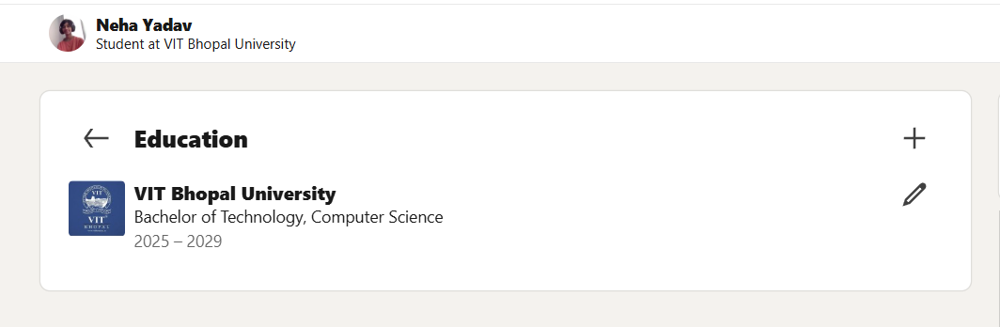

<!DOCTYPE html>
<html>
<h2>🌐 Portfolio Platforms Report</h2>

For my professional online presence, I chose GitHub 💻 and LinkedIn 💼 as my primary platforms. 
GitHub is mainly used for showcasing technical projects, code repositories, and development skills. 
It helps in building a strong portfolio by demonstrating practical knowledge and consistency in coding. 
LinkedIn, on the other hand, is a professional networking platform used to connect with industry professionals 🤝, 
recruiters, and peers. It allows me to present my educational background 🎓, skills, and achievements in a formal manner.

Over the next four years, I plan to actively use GitHub to upload projects, participate in open-source contributions, 
and improve my coding profile 🚀. On LinkedIn, I aim to build a strong professional network, share achievements, 
and explore internship and job opportunities. Together, these platforms will help me enhance my visibility, 
develop my professional identity, and prepare for future career opportunities 📈.

<h3>📸 GitHub Profile Screenshot</h3>

<h3>📸 LinkedIn Profile Screenshot</h3>

</body>
</html>
